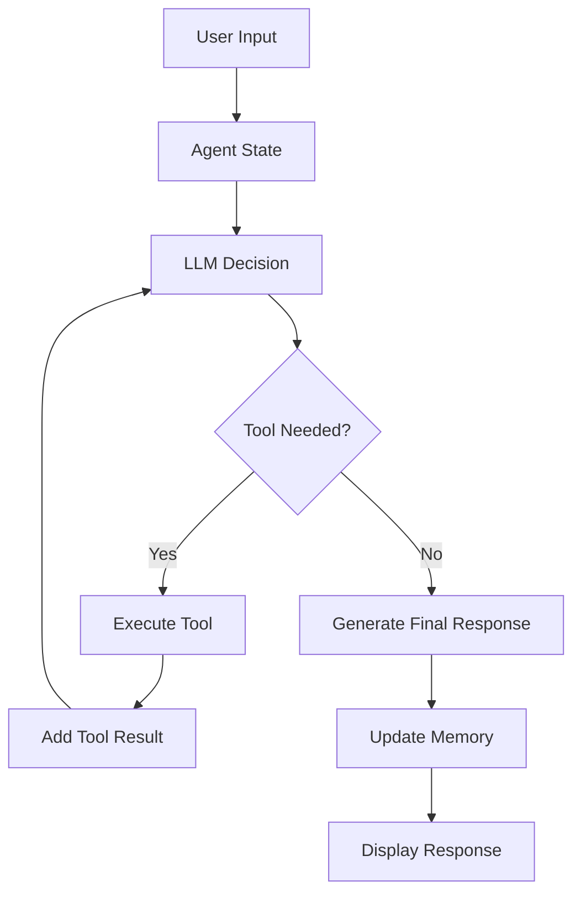

# 🏗️ How Alfred Works

A simple overview of Alfred's components and how they work together.

## 🎯 System Overview

Alfred is built using a **LangGraph-based agent architecture** with **OpenAI GPT-4** as the reasoning engine. The system combines multiple tools and data sources including
- **Web search** for current information
- **Guest data** for background information  


### 1. **Agent Workflow (app.py)**

The main orchestration layer built with LangGraph:

```python
class AgentState(TypedDict):
    messages: Annotated[list[AnyMessage], add_messages]

def assistant(state: AgentState):
    response = llm.invoke(state["messages"])
    return {"messages": response["messages"]}
```

**Key Features:**
- **State Management**: Tracks conversation history
- **Tool Integration**: Routes to appropriate tools based on agent decisions
- **Memory Management**: Implements rolling memory window
- **Multi-turn Reasoning**: Handles complex queries requiring multiple tool calls

### 2. **Language Model Integration (OpenAILLM)**

Custom wrapper for OpenAI API:

```python
class OpenAILLM:
    def __init__(self, model="gpt-4", api_key=None):
        self.client = OpenAI(api_key=api_key or os.environ["OPENAI_API_KEY"])
        self.model = model
```

**Responsibilities:**
- API communication with OpenAI
- Message formatting
- Response parsing
- Error handling

### 3. **Tool System (tools.py)**

Modular tool definitions for different capabilities:

#### Web Search Tool
```python
def web_search_tool(query: str) -> str:
    with DDGS() as ddgs:
        results = list(ddgs.text(query, max_results=5))
    return format_search_results(results)
```

#### Hub Statistics Tool
```python
def hub_stats_tool(query: str) -> str:
    # Provides Hugging Face Hub statistics
    # Useful for AI/ML related queries
```

### 4. **Retrieval System (retriever.py)**

Vector-based information retrieval:

```python
def guest_info_tool(query: str) -> str:
    # Uses FAISS vector store for guest information
    # Combines with BM25 for hybrid search
```

**Features:**
- **FAISS Vector Store**: Fast similarity search
- **HuggingFace Embeddings**: Sentence transformers for encoding
- **Hybrid Search**: Combines dense and sparse retrieval

### 5. **User Interface (streamlit_app.py)**

Web-based chat interface:

```python
if prompt := st.chat_input("What would you like to know?"):
    response = run_agent_with_tools(messages)
```
Multi-turn conversations are handled by Streamlit's session state and reactive execution model where `st.session_state` maintains data between executions and each user input triggers a fresh script execution with previous context being automatically preserved.

## 🔄 How It Works

1. **You ask a question** → Streamlit interface
2. **Alfred thinks** → Decides which tools to use
3. **Tools gather info** → Web search, guest data, etc.
4. **Alfred responds** → Combines all information
5. **You get an answer** → Helpful response for party prep

### 1. **User Input Processing**
```
User Query → Streamlit Interface → Agent State → LLM Processing
```

### 2. **Tool Execution Loop**
```
LLM Decision → Tool Selection → Tool Execution → Result Processing → LLM Reasoning
```

### 3. **Response Generation**
```
Final Reasoning → Response Formatting → UI Display → Memory Update
```

## 🛠️ Tool Execution Architecture

### Multi-turn Reasoning Flow



### Tool Execution Logic

```python
def run_agent_with_tools(messages, max_steps=10):
    for _ in range(max_steps):
        response = alfred.invoke({"messages": messages[-ROLLING_MEMORY_WINDOW:]})
        last_msg = messages[-1]
        
        if hasattr(last_msg, "tool_call"):
            # Execute tool and continue loop
            tool_result = execute_tool(last_msg)
            messages.append(AIMessage(content=tool_result))
        else:
            # Final answer produced
            break
    return messages
```

## 📊 Memory Management

### Rolling Memory Window

```python
ROLLING_MEMORY_WINDOW = 50  # Keep last 50 messages
```

**Benefits:**
- **Context Management**: Prevents context overflow
- **Performance**: Maintains reasonable response times
- **Cost Control**: Limits token usage
- **Relevance**: Focuses on recent conversation

### Memory Structure

```python
messages = [
    HumanMessage(content="Tell me about Dr. Tesla"),
    AIMessage(content="Dr. Nikola Tesla was..."),
    HumanMessage(content="What about his wireless energy work?"),
    AIMessage(content="Tesla's wireless energy experiments...")
]
```

## 🔧 Configuration Management

### Environment Variables
```bash
OPENAI_API_KEY=your-key-here
```

### **Model Options**
```python
# In app.py
llm = OpenAILLM(model="gpt-4")  # or "gpt-3.5-turbo"
```

## 🔮 Future Enhancements

### Planned Features
1. **Async Tool Execution**: Parallel tool processing for improved response times
2. **API Endpoints**: RESTful API for integration with other applications
3. **Enhanced Monitoring**: Comprehensive logging and performance metrics
4. **Caching Layer**: Redis for tool results to reduce API calls when things scale
5. **Multi-modal Support**: Image and document processing capabilities
